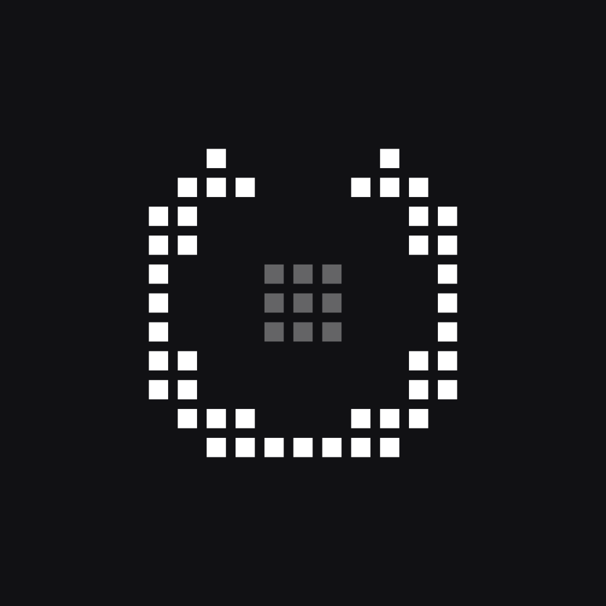
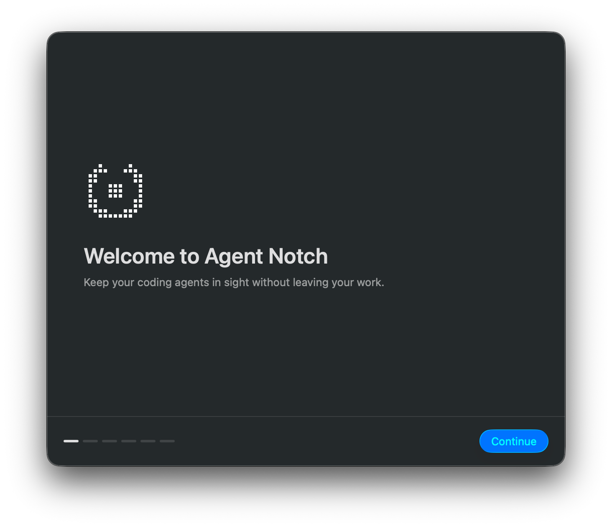
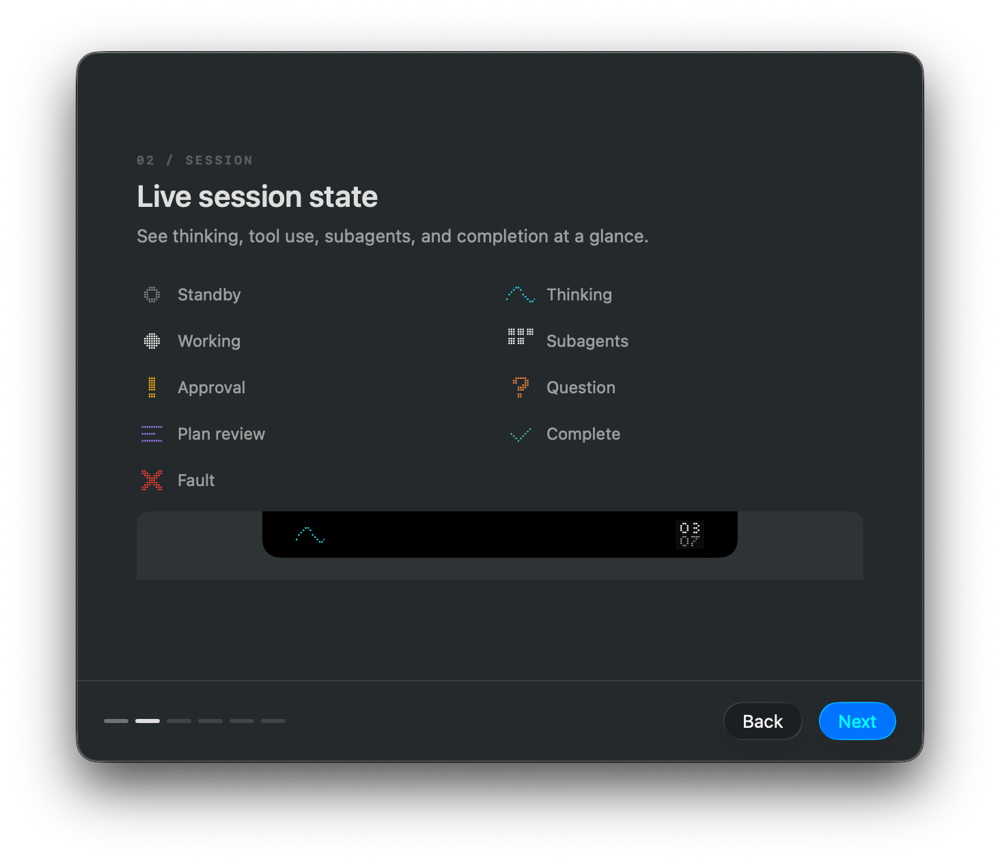

# Agent Notch

<p align="center">
  
</p>

<p align="center">
  
  
</p>

A free, open-source, multi-agent macOS app that turns your Mac's notch into a **unified command center** for AI coding agents (Claude Code, Codex, and more).

Session state, running tools, token usage, and permission requests appear live in the notch, so you can follow what your agents are doing without switching to a terminal.

## Features

- **Multi-agent**: Claude Code and Codex sessions rendered through one unified model (extensible to other agents)
- **Live status**: thinking, tool execution, waiting for permission, and completion at a glance
- **Permission requests**: approve or deny straight from the notch
- **Open source and free**: shipped as a native, non-sandboxed app

## Install

Install from the Homebrew tap:

```bash
brew install --cask tosaka07/tap/agent-notch
```

This installs `AgentNotch.app` into `/Applications` and links the bundled CLI as `agent-notch` on
your `PATH`, which the agent hooks rely on.

Upgrading and uninstalling go through Homebrew as well:

```bash
brew upgrade --cask agent-notch
brew uninstall --cask agent-notch
```

Apple silicon only, and the cask requires macOS 26 (Tahoe) or later.

## Requirements

- macOS 26 or later
- Swift tools 6.2 or later (there is no Xcode project; SPM's `Package.swift` is the source of truth)

## Setup

```bash
# Build (debug)
swift build

# Build the neighboring hook helper, then run the GUI app
swift build --product agent-notch
swift run AgentNotch
#   Change log level: AGENT_NOTCH_LOG=debug swift run AgentNotch

# Run it as a bundle instead, which anything sending Apple events needs
./scripts/make_app.sh debug && open build/AgentNotch.app
```

`swift run` produces a bare executable, which has no TCC identity of its own. macOS then attributes
the Apple events it sends to whichever app started it — the terminal the command was run from. The
automation prompt names that terminal, the permission is granted to it rather than to Agent Notch,
and `NSAppleEventsUsageDescription` is never read. Selecting the cmux pane a session runs in, on a
terminal jump, is the one feature that sends Apple events; exercise it from a bundle launched with
`open`, which goes through Launch Services and so answers for itself. The bundle is unsigned, so
each rebuild changes its identity and the permission has to be granted again.

The first-run onboarding explains the hook changes and installs them only after you approve.
Until installation succeeds, Agent Notch does not start its session runtime. Hooks can be checked
and reinstalled later from Settings. You can also drive development hook installation explicitly
from the CLI:

```bash
# CLI (the hook itself; normally invoked by the agent's hook config)
swift run agent-notch install --development
swift run agent-notch remove
swift run agent-notch hook --agent claude   # stdin JSON -> forwarded over the socket
swift run agent-notch hook --agent codex
```

Release packages must expose the bundled CLI on `PATH` as `agent-notch`. For example, a Homebrew
Cask should declare the bundled `AgentNotch.app/Contents/MacOS/agent-notch` as a `binary`. The
production hook definition then stays stable as `agent-notch hook ...` across app updates.

## Tests

```bash
swift test
swift test --filter AgentNotchTests.TranscriptParserTests           # One file
swift test --filter AgentNotchTests.TranscriptParserTests/testName  # One test
```

## Architecture overview

The package has three executable targets, one library, and one test target. Everything that does not depend on the UI lives in `AgentNotchCore`, so both the GUI and the CLI can use it.

| Target | Role |
| --- | --- |
| `AgentNotchCore/` | Models, event parsers, socket server/client, hook installer (no AppKit/SwiftUI dependency) |
| `AgentNotch/` | GUI app. `NotchPanel` (NSPanel) + SwiftUI views |
| `AgentNotchCLI/` | The `agent-notch` binary (hook entry point + installer) |
| `AgentNotchTests/` | Swift Testing suites covering both Core and GUI |

Events flow in one direction: the agent fires a hook, the hook forwards the event over a Unix socket, `EventProcessor` updates session state, and SwiftUI re-renders.

## Contributing

Issues and pull requests are welcome. Run `swift test` before opening a pull request.

## License

Agent Notch's original source code is available under the [MIT License](LICENSE).
Bundled third-party components remain under their respective licenses, which are
listed in **Settings → About**.
